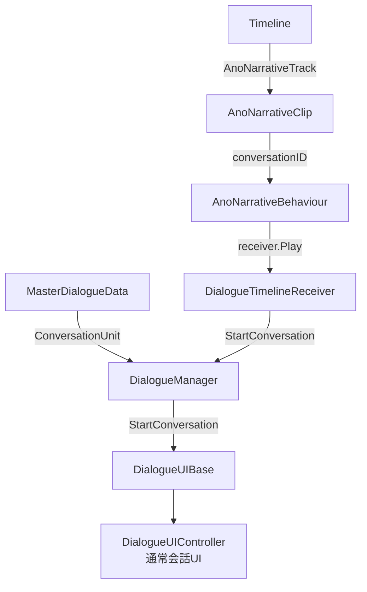

# AnoNarative 使い方ガイド

## 概要

**AnoNarative** は、本プロジェクト専用の会話・対話システムです。
Timeline と連携して会話を再生し、MasterDialogueData でセリフデータを一元管理します。

> [!IMPORTANT]
> プロジェクト内の会話・対話はすべて AnoNarative を使用すること。
> 旧システム（Pixel Crushers Dialogue System）は使用しない。

---

## システム構成



### 主要コンポーネント

| コンポーネント | 場所 | 役割 |
|---|---|---|
| `MasterDialogueData` | ScriptableObject (asset) | 全会話データの一元管理 |
| `ConversationUnit` | Data クラス | 1つの会話ノード（話者・本文・選択肢・次ノード） |
| `DialogueManager` | シーン上（シングルトン） | 会話の開始・停止・UI解決・変数管理 |
| `DialogueUIBase` | 抽象クラス | 会話UI の基底（スタイルごとに派生） |
| `DialogueUIController` | UI コンポーネント | 標準的な会話表示（タイピングアニメ・選択肢） |
| `AnoNarrativeTrack` | Timeline Track | タイムラインに配置する会話トラック |
| `AnoNarrativeClip` | PlayableAsset | 再生する会話ID・スタイル・一時停止設定を保持 |
| `AnoNarrativeBehaviour` | PlayableBehaviour | 実行時に会話を開始し、終了まで待機 |
| `AnoNarrativeMixer` | PlayableBehaviour | トラックバインディング(Receiver)をBehaviourに注入 |
| `DialogueTimelineReceiver` | MonoBehaviour | Timeline↔DialogueManager の橋渡し |

---

## 会話データの構造（ConversationUnit）

| フィールド | 型 | 説明 |
|---|---|---|
| `ID` | string | ユニークID（GUID） |
| `EpisodeID` | int | エピソード（-1 = 汎用） |
| `ChapterID` | int | チャプター（-1 = ワイルドカード） |
| `SectionID` | int | セクション（-1 = ワイルドカード） |
| `NodeNumber` | int | セクション内の順序 |
| `SectionName` | string | セクションの表示名 |
| `SpeakerName` | string | 話者名（ポートレート解決にも使用） |
| `BodyText` | string | セリフ本文 |
| `NextID` | string | 次ノードのID（空なら会話終了） |
| `Choices` | List\<Choice\> | 分岐選択肢（ChoiceText + TargetID） |

---

## 会話の作成〜再生フロー

### 1. データ作成

`MasterDialogueData` アセットに `ConversationUnit` を追加する。

- `ID` は自動生成される GUID
- `EpisodeID` / `ChapterID` / `SectionID` はプロジェクトルールに従って設定
- `BodyText` にセリフを記述

### 2. タイムラインの設定

1. Timeline に **AnoNarrativeTrack** を追加
2. トラックのバインディングに **DialogueTimelineReceiver** を設定
3. トラック上に **AnoNarrativeClip** を配置
4. Clip の Inspector で以下を設定：
   - `conversationID`: MasterDialogueData の該当会話の **ID (GUID)**
   - `dialogueStyleName`: `"通常"` など
   - `pauseTimeline`: `true`（会話中はタイムライン一時停止）

### 3. 実行時の動作

```
Timeline再生 → AnoNarrativeClip → AnoNarrativeBehaviour.OnBehaviourPlay()
  → receiver.Play(conversationID, styleName)
  → DialogueManager.StartConversation(id, styleName)
  → ConversationUnit を取得
  → DialogueUIController.ShowConversation(unit)
  → タイピングアニメーションでセリフ表示
  → ユーザー入力で次へ / 選択肢で分岐
  → NextID が空なら会話終了 → タイムライン再開
```

---

## テンプレート変数（動的テキスト置換）

> [!NOTE]
> **今後の実装予定**: ローカライズ機能とあわせて正式実装する。

会話テキスト内に `{変数名}` を埋め込み、実行時に動的に差し替える仕組み。

### 使用例：アイテム使用時の会話

旧システムでは Lua テンプレートを使用していた：
```
[lua(GetTextTableValue(Variable["itemName"]))]を使用した
```

新システムでは以下のように記述する：
```
{itemName}を使用した。
```

### 仕組み

1. **変数を設定する側**（例: `InventoryController`）
   ```csharp
   DialogueManager.Instance.SetVariable("itemName", displayName);
   ```

2. **MasterDialogueData の BodyText**
   ```
   {itemName}を使用した。
   ```

3. **表示時に自動置換**
   `DialogueManager.ResolveVariables()` が `{itemName}` を実際の値に置き換えてから表示する。

### フロー

```
InventoryController.Consume()
  → DialogueManager.SetVariable("itemName", "磁石")
  → Hide() → Event実行 → Timeline再生
  → AnoNarrativeClip → StartConversation
  → BodyText "{itemName}を使用した。"
  → ResolveVariables → "磁石を使用した。"
  → DialogueUIController で表示
```

---

## 注意事項

- `conversationID` は MasterDialogueData のユニーク ID（GUID）を指定すること
- `targetEpisode` / `targetChapter` / `targetSection` は現在 `HideInInspector` でエディタ上非表示
- 会話スタイル（見た目）は `DialogueUIBase` の派生クラスで制御し、`styleName` で切り替える
- テンプレート変数の `{}` はネストしないこと
